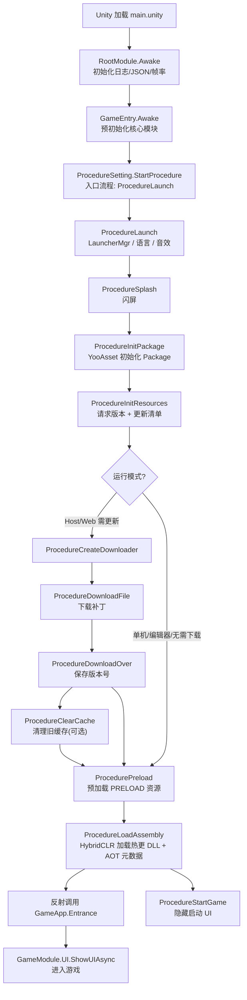

# TEngine 启动流程文档

> 基于当前项目代码梳理。涵盖从 Unity 场景加载到进入游戏逻辑的完整链路、各流程职责、热更边界与扩展点。

---

## 一、总览

启动分三个阶段：

| 阶段 | 所在层 | 是否热更 | 说明 |
|------|--------|----------|------|
| 引擎初始化 | `RootModule` / `GameEntry` | 否（主包） | 初始化核心模块，启动流程状态机 |
| 主包流程链 | `Procedure/*`（Assembly-CSharp） | 否（主包） | 资源初始化、热更下载、加载热更 DLL |
| 热更逻辑 | `GameApp`（GameLogic） | 是（热更） | 反射调用进入业务逻辑 |

整体链路：



---

## 二、阶段一：引擎初始化（主包）

### 1. 场景入口

启动场景：`Assets/Scenes/main.unity`，挂载 `GameEntry` 预制体
（`Assets/TEngine/Settings/Prefab/GameEntry.prefab`），其上含两个关键组件：

- `RootModule`：框架根模块，驱动 `ModuleSystem.Update()`
- `GameEntry`：游戏启动脚本

### 2. RootModule.Awake

`Assets/TEngine/Runtime/Module/RootModule.cs`，先于 `GameEntry` 完成基础设施初始化：

- 初始化 TextHelper / LogHelper / JsonHelper
- 设置屏幕 DPI、目标帧率（默认 120）、时间缩放、后台运行、防休眠
- 注册 `Application.lowMemory` 回调
- 每帧 `Update` 调用 `ModuleSystem.Update(...)` 驱动所有框架模块

### 3. GameEntry.Awake

`Assets/GameScripts/GameEntry.cs`：

```6:14:Assets/GameScripts/GameEntry.cs
    void Awake()
    {
        ModuleSystem.GetModule<IUpdateDriver>();
        ModuleSystem.GetModule<IResourceModule>();
        ModuleSystem.GetModule<IDebuggerModule>();
        ModuleSystem.GetModule<IFsmModule>();
        Settings.ProcedureSetting.StartProcedure().Forget();
        DontDestroyOnLoad(this);
    }
```

职责：

1. 预初始化核心模块（帧驱动、资源、调试器、状态机）
2. 启动流程状态机 `ProcedureSetting.StartProcedure()`
3. `DontDestroyOnLoad` 常驻

### 4. StartProcedure

`Assets/TEngine/Runtime/Module/ProcedureModule/ProcedureSetting.cs`：

- 从 `ProcedureSetting.asset` 读取 `availableProcedureTypeNames` 列表，反射实例化全部流程
- 以 `entranceProcedureTypeName` 为入口（当前配置为 `Procedure.ProcedureLaunch`）
- 调用 `IProcedureModule.StartProcedure(入口类型)` 启动状态机

> 入口流程配置见 `Assets/TEngine/Settings/ProcedureSetting.asset`。

---

## 三、阶段二：主包流程链（不可热更）

所有流程位于 `Assets/GameScripts/Procedure/`，继承本地 `ProcedureBase`
（`Assets/GameScripts/Procedure/ProcedureBase.cs`），该基类持有 `_resourceModule` 并约定 `UseNativeDialog`。

流程切换通过 `ChangeState<T>(procedureOwner)`。

### 流程清单与职责

| 顺序 | 流程 | 职责 | 下一步 |
|------|------|------|--------|
| 1 | `ProcedureLaunch` | 初始化 `LauncherMgr`、语言配置、音效配置 | `ProcedureSplash` |
| 2 | `ProcedureSplash` | 闪屏（当前直接跳转，可扩展播放动画） | `ProcedureInitPackage` |
| 3 | `ProcedureInitPackage` | YooAsset `InitPackage` 初始化默认包，初始化热更文本 | `ProcedureInitResources` |
| 4 | `ProcedureInitResources` | 请求资源版本、更新 Manifest，按运行模式分流 | 见下 |
| 5 | `ProcedureCreateDownloader` | 创建差量下载器，统计待下载数量/大小 | `ProcedureDownloadFile` 或 `ProcedureDownloadOver` |
| 6 | `ProcedureDownloadFile` | 下载补丁，刷新进度/网速/剩余时间 | `ProcedureDownloadOver` |
| 7 | `ProcedureDownloadOver` | 保存本地版本号 `GAME_VERSION` | `ProcedureClearCache` 或 `ProcedurePreload` |
| 8 | `ProcedureClearCache` | 清理冗余缓存 `ClearCacheFilesAsync` | `ProcedurePreload` |
| 9 | `ProcedurePreload` | 预加载 `PRELOAD`（及 WebGL `WEBGL_PRELOAD`）标签资源 | `ProcedureLoadAssembly` |
| 10 | `ProcedureLoadAssembly` | HybridCLR 加载热更 DLL + AOT 元数据，反射调用 `GameApp.Entrance` | `ProcedureStartGame` |
| 11 | `ProcedureStartGame` | 隐藏全部启动 UI，正式进入游戏 | （结束） |

### 关键分支：运行模式（ProcedureInitResources / ProcedureInitPackage）

`ProcedureInitPackage` 按 `EPlayMode` 分流，`ProcedureInitResources` 再细分是否需要下载：

- **EditorSimulateMode（编辑器模拟）**：跳过下载，直接进入预加载
- **OfflinePlayMode（单机）**：跳过下载，直接进入预加载
- **HostPlayMode（联机可更新）**：请求远端版本 → 更新清单 → 有差量则进入下载链
- **WebPlayMode / 边玩边下**：直接进入预加载（`ProcedurePreload`）

下载失败时弹原生/UI 对话框，支持「重试」或 `Application.Quit`。

### 下载子链说明

- `ProcedureCreateDownloader`：若 `TotalDownloadCount == 0` 直接跳 `ProcedureDownloadOver`，否则弹确认框开始下载。
- `ProcedureDownloadOver`：内部 `_needClearCache` 默认为 `false`，因此默认下载完直接进入 `ProcedurePreload`；置位后才会经过 `ProcedureClearCache`。

---

## 四、阶段三：加载热更 DLL 与进入热更域

### 1. ProcedureLoadAssembly

`Assets/GameScripts/Procedure/ProcedureLoadAssembly.cs`，是主包与热更域的桥梁：

- **编辑器 / 未启用热更**：从 `AppDomain.CurrentDomain` 直接取已加载的 `GameLogic.dll`
- **真机联机模式**：通过 YooAsset 加载 `HotUpdateAssemblies` 对应的 `.bytes`，用 `Assembly.Load(bytes)` 加载
- **AOT 元数据补充**（仅非编辑器）：对 `AOTMetaAssemblies` 调用
  `HybridCLR.RuntimeApi.LoadMetadataForAOTAssembly`，解决 AOT 泛型缺失
- 全部加载完成后，反射调用入口：

```142:149:Assets/GameScripts/Procedure/ProcedureLoadAssembly.cs
            var entryMethod = appType.GetMethod("Entrance");
            if (entryMethod == null)
            {
                Log.Fatal($"Main logic entry method 'Entrance' missing.");
                return;
            }
            object[] objects = new object[] { new object[] { _hotfixAssemblyList } };
            entryMethod.Invoke(appType, objects);
```

> 注意：先 `ChangeState<ProcedureStartGame>` 再反射调用 `Entrance`，二者前后衔接。

相关配置（`Assets/TEngine/Settings/UpdateSetting.asset`）：

- `HotUpdateAssemblies`：`GameProto.dll`、`GameLogic.dll`
- `LogicMainDllName`：`GameLogic.dll`
- `AssemblyTextAssetPath`：`AssetRaw/DLL`，扩展名 `.bytes`

### 2. GameApp.Entrance（热更入口）

`Assets/GameScripts/HotFix/GameLogic/GameApp.cs`：

```25:40:Assets/GameScripts/HotFix/GameLogic/GameApp.cs
    public static void Entrance(object[] objects)
    {
        GameEventHelper.Init();
        _hotfixAssembly = (List<Assembly>)objects[0];
        Log.Warning("======= 看到此条日志代表你成功运行了热更新代码 =======");
        Log.Warning("======= Entrance GameApp =======");
        Utility.Unity.AddDestroyListener(Release);
        Log.Warning("======= StartGameLogic =======");
        StartGameLogic();
    }
```

执行顺序（约束）：

1. `GameEventHelper.Init()` —— 必须最先调用，先于任何 `GameEvent.Get<T>()`
2. 保存热更程序集列表（`objects[0]` 强转 `List<Assembly>`）
3. `AddDestroyListener(Release)` —— 注册销毁回调，`Release` 内 `SingletonSystem.Release()`
4. `StartGameLogic()` —— 当前直接 `GameModule.UI.ShowUIAsync<BattleMainUI>()`

### 3. ProcedureStartGame

`Assets/GameScripts/Procedure/ProcedureStartGame.cs`：`await UniTask.Yield()` 后 `LauncherMgr.HideAllUI()`，关闭启动器界面。

---

## 五、热更边界

| 区域 | 程序集 | 是否热更 |
|------|--------|----------|
| `Assets/TEngine/Runtime/` | `TEngine.Runtime` | 否 |
| `Assets/Launcher/` | `Launcher` | 否 |
| `Assets/GameScripts/`（GameEntry + Procedure） | `Assembly-CSharp` | 否 |
| `Assets/GameScripts/HotFix/GameProto/` | `GameProto` | 是 |
| `Assets/GameScripts/HotFix/GameLogic/` | `GameLogic` | 是 |
| `Assets/AssetRaw/` 资源 | —（YooAsset） | 资源热更 |

> 结论：整个启动流程链（`GameEntry` + `Procedure/*`）属于主包，**不可热更**；进入 `GameApp.Entrance` 之后的业务逻辑属于 `GameLogic`，**可热更**。

---

## 六、扩展点

| 需求 | 扩展位置 |
|------|----------|
| 新增启动阶段（如登录前置） | 在 `Procedure/` 新增流程，并在 `ProcedureSetting.asset` 注册 |
| 修改闪屏 | `ProcedureSplash`（当前为空跳转） |
| 调整预加载资源 | 给资源打 `PRELOAD` 标签；逻辑见 `ProcedurePreload.LoadAllConfig` |
| 热更入口初始化（注册系统等） | `partial class GameApp` 扩展 `Entrance` / `StartGameLogic` |
| 进入游戏首个界面 | `GameApp.StartGameLogic`（当前为 `BattleMainUI`） |

---

## 七、相关文件索引

| 作用 | 路径 |
|------|------|
| 启动场景 | `Assets/Scenes/main.unity` |
| 启动预制体 | `Assets/TEngine/Settings/Prefab/GameEntry.prefab` |
| 引擎入口 | `Assets/GameScripts/GameEntry.cs` |
| 根模块 | `Assets/TEngine/Runtime/Module/RootModule.cs` |
| 流程配置（资产） | `Assets/TEngine/Settings/ProcedureSetting.asset` |
| 流程启动器 | `Assets/TEngine/Runtime/Module/ProcedureModule/ProcedureSetting.cs` |
| 主包流程 | `Assets/GameScripts/Procedure/*.cs` |
| 热更配置 | `Assets/TEngine/Settings/UpdateSetting.asset` |
| 热更入口 | `Assets/GameScripts/HotFix/GameLogic/GameApp.cs` |
| 模块访问门面 | `Assets/GameScripts/HotFix/GameLogic/GameModule.cs` |
