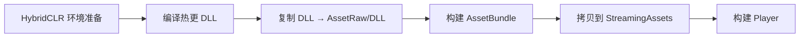

# TEngine 打包流程文档

> 基于当前项目代码梳理。涵盖 HybridCLR + YooAsset 完整打包链路、各平台操作步骤、输出目录与常见问题。

---

## 一、总览

TEngine 打包**不是**单纯点 Unity 的 `Build`，而是按顺序完成：



| 阶段 | 菜单/入口 | 输出 |
|------|-----------|------|
| HybridCLR 生成 | `HybridCLR → Generate → All` | `HybridCLRGenerate/`、il2cpp 桥接代码 |
| 热更 DLL | `HybridCLR → Build → BuildAssets And CopyTo...` | `Assets/AssetRaw/DLL/*.dll.bytes` |
| AssetBundle | `TEngine → Build → 一键打包AssetBundle` | `Builds/{平台}/DefaultPackage/{版本}/` |
| 内置资源 | AB 构建自动拷贝（需配置） | `Assets/StreamingAssets/package/DefaultPackage/` |
| Player | `TEngine → Build → 一键打包{平台}` | `Build/{平台}/` |

核心代码入口：`Assets/TEngine/Editor/ReleaseTools/ReleaseTools.cs` → `BuildWithConfig()`

---

## 二、打包前检查（所有平台通用）

### 2.1 Unity 项目设置

| 检查项 | 要求 | 位置 |
|--------|------|------|
| Scripting Backend | **IL2CPP** | Player Settings → Other Settings |
| HybridCLR 已安装 | `HybridCLR/Installer` 已执行 | HybridCLR 菜单 |
| `ENABLE_HYBRIDCLR` 宏 | **必须开启** | `HybridCLR → Define Symbols → Enable HybridCLR` |
| 启动场景 | `Assets/Scenes/main.unity` 在 Build Settings 中 | File → Build Settings |

> **重要**：未开启 `ENABLE_HYBRIDCLR` 时，`BuildAssets And CopyTo AssemblyTextAssetPath` 菜单**不会执行任何操作**（方法体被 `#if` 剔除）。

### 2.2 资源运行模式

`GameEntry.prefab` → `ResourceModuleDriver`：

| 模式 | 值 | 适用场景 |
|------|-----|----------|
| EditorSimulateMode | 0 | 仅编辑器 Play（运行时自动转 Offline） |
| OfflinePlayMode | 1 | **单机包 / 首包内置资源** |
| HostPlayMode | 2 | 联机热更（需 CDN） |
| WebPlayMode | 3 | WebGL 远程资源 |

打发布包前确认 `playMode` 为 **OfflinePlayMode** 或 **HostPlayMode**（按需求）。

### 2.3 打包工具推荐配置

打开 **`TEngine → Build → 打包工具窗口`**：

| 配置项 | 推荐值 |
|--------|--------|
| 构建管线 | ScriptableBuildPipeline (SBP) |
| 压缩方式 | LZ4 |
| 加密方式 | 无加密 |
| 内置文件拷贝 | **ClearAndCopyAll（清空后拷贝全部）** |
| 构建前编译热更 DLL | **勾选** |
| 资源版本号 | 每次打包点 **「自动」**（避免版本目录冲突） |
| 最小包模式 | 首包调试时 **关闭** |

---

## 三、首次打包 / 环境初始化

按顺序执行（**每个平台 Switch Platform 后建议重新做 ③④**）：

### 步骤 1：开启 HybridCLR

```
HybridCLR → Define Symbols → Enable HybridCLR
```

等待脚本重新编译完成。

### 步骤 2：生成 HybridCLR 代码

```
HybridCLR → Generate → All
```

### 步骤 3：切换目标平台

```
File → Build Settings → 选择目标平台 → Switch Platform
```

### 步骤 4：首次构建 Player（生成 AOT 裁剪 DLL）

首次需要打一次 Player（可用 Development Build），以生成：

```
HybridCLRData/AssembliesPostIl2CppStrip/{BuildTarget}/
```

> AOT 补充元数据（`mscorlib.dll` 等）依赖此目录，否则复制 `.bytes` 会报「文件不存在」。

### 步骤 5：复制热更 DLL

```
HybridCLR → Build → BuildAssets And CopyTo AssemblyTextAssetPath
```

成功后 `Assets/AssetRaw/DLL/` 应包含：

```
GameLogic.dll.bytes
GameProto.dll.bytes
mscorlib.dll.bytes
System.dll.bytes
System.Core.dll.bytes
TEngine.Runtime.dll.bytes
YooAsset.dll.bytes
UniTask.dll.bytes
UnityEngine.CoreModule.dll.bytes
```

Console 应出现 `CopyHotUpdateAssembliesToStreamingAssets` / `CopyAOTAssembliesToStreamingAssets` 日志。

### 步骤 6：一键完整打包

使用打包工具窗口 **「一键构建 (AB + Player)」**，或对应平台快捷菜单（见下文）。

---

## 四、日常打包流程（环境已就绪）

```
1. 修改热更代码后：HybridCLR → Generate → All（有泛型/桥接变更时）
2. TEngine → Build → 打包工具窗口
3. 选择目标平台
4. 资源版本号 → 点「自动」
5. 确认：内置文件拷贝 = ClearAndCopyAll，编译热更 DLL = 勾选
6. 点「一键构建 (AB + Player)」
```

**仅更新资源、不重打 Player：**

```
TEngine → Build → 一键打包AssetBundle   （快捷键 F8）
```

---

## 五、各平台打包指南

### 5.1 Windows 64-bit

| 项 | 值 |
|----|-----|
| BuildTarget | `StandaloneWindows64` |
| Architecture | **Intel 64-bit**（Build Settings 窗口，非 Player Settings） |
| 快捷菜单 | `TEngine → Build → 一键打包Window` |
| AB 输出 | `Builds/Windows/DefaultPackage/{版本}/` |
| Player 输出 | `Build/Windows/Release_Windows.exe` |

**环境要求：**

- Visual Studio 2022 Build Tools +「使用 C++ 的桌面开发」+ Windows 10/11 SDK
- 不要打 32 位（x86）包，IL2CPP + HybridCLR 在 32 位下易崩溃

**验证 StreamingAssets：**

```
Build/Windows/Release_Windows_Data/StreamingAssets/package/DefaultPackage/
├── BuildinCatalog.bytes          ← 必须有
├── DefaultPackage.version
├── DefaultPackage_{版本}.bytes
├── defaultpackage_assets_assetraw_dll.bundle   ← 热更 DLL
└── *.bundle
```

**运行日志：**

```
%USERPROFILE%\AppData\LocalLow\DefaultCompany\Unity\Player.log
```

命令行指定日志：

```powershell
.\Release_Windows.exe -logfile log.txt
```

---

### 5.2 macOS

| 项 | 值 |
|----|-----|
| BuildTarget | `StandaloneOSX` |
| 打包工具平台 | macOS |
| Player 输出 | `Build/MacOS/Release_MacOS.app` |
| AB 输出 | `Builds/StandaloneOSX/DefaultPackage/{版本}/` |

**注意：**

- 需在 **macOS 主机**上 Switch Platform 并构建
- 首次打包同样需先打 Player 生成 `AssembliesPostIl2CppStrip/StandaloneOSX/`
- 热更 DLL 目录为 `HybridCLRData/HotUpdateDlls/StandaloneOSX/`

---

### 5.3 Linux 64-bit

| 项 | 值 |
|----|-----|
| BuildTarget | `StandaloneLinux64` |
| 打包工具平台 | Linux |
| Player 输出 | `Build/Linux/Release_Linux` |
| AB 输出 | `Builds/StandaloneLinux64/DefaultPackage/{版本}/` |

**注意：**

- 建议在 Linux 或支持 Linux 构建的 CI 环境执行
- 热更 DLL 目录：`HybridCLRData/HotUpdateDlls/StandaloneLinux64/`

---

### 5.4 Android

| 项 | 值 |
|----|-----|
| BuildTarget | `Android` |
| 快捷菜单 | `TEngine → Build → 一键打包Android` |
| AB 输出 | `Bundles/DefaultPackage/{版本}/` |
| Player 输出 | `Build/Android/{版本}Android.apk` |

**打包前：**

1. 安装 Android SDK / NDK（Unity Hub → 对应模块）
2. Player Settings → Android → 配置包名、签名、Min SDK 等
3. Switch Platform 到 Android
4. 执行首次 Player 构建 → 复制 DLL → 一键打包

**热更 DLL 目录：** `HybridCLRData/HotUpdateDlls/Android/`

**联机模式：** 修改 `UpdateSetting.asset` 中 `ResDownLoadPath` 为 CDN 地址，并将 `playMode` 设为 HostPlayMode。

---

### 5.5 iOS

| 项 | 值 |
|----|-----|
| BuildTarget | `iOS` |
| 快捷菜单 | `TEngine → Build → 一键打包IOS` |
| AB 输出 | `Bundles/DefaultPackage/{版本}/` |
| Player 输出 | `Build/IOS/XCode_Project`（Xcode 工程） |

**打包后：**

1. 用 Xcode 打开 `XCode_Project`
2. 配置证书、Provisioning Profile
3. Archive → 上传 App Store 或 Ad Hoc 分发

**注意：**

- 必须在 **macOS** 上构建
- 热更 DLL 目录：`HybridCLRData/HotUpdateDlls/iOS/`

---

### 5.6 WebGL

| 项 | 值 |
|----|-----|
| BuildTarget | `WebGL` |
| 打包工具平台 | WebGL |
| Player 输出 | `Build/WebGL/` |
| AB 输出 | `Builds/WebGL/DefaultPackage/{版本}/` |

**资源加载模式（`UpdateSetting.asset`）：**

| LoadResWayWebGL | 说明 |
|-----------------|------|
| Remote (0) | 从远程 CDN 加载（HostPlayMode） |
| StreamingAssets (1) | 首包内置资源 |

**注意：**

- WebGL 对 HybridCLR 有额外限制，需关注官方兼容说明
- 构建前在 Player Settings 中配置 WebGL 内存、压缩格式等
- 热更 DLL 目录：`HybridCLRData/HotUpdateDlls/WebGL/`

---

## 六、打包工具窗口说明

**入口：** `TEngine → Build → 打包工具窗口`

### 6.1 三个构建按钮

| 按钮 | 作用 |
|------|------|
| 构建 AssetBundle | 仅打 AB + 拷贝 StreamingAssets，不打 Player |
| 构建 Player | 仅打 Player（需 StreamingAssets 已是最新） |
| **一键构建 (AB + Player)** | 完整流程（推荐） |

### 6.2 高级设置

| 配置 | 说明 |
|------|------|
| 启用共享资源打包 | 提取公共资源到独立 bundle |
| 使用资源依赖数据库 | 加速增量打包 |
| 清理构建缓存 | 全量重建（遇奇怪 AB 问题时勾选） |
| 验证构建结果 | 构建后校验完整性 |
| 文件名风格 | 默认 BundleName_HashName |

### 6.3 最小包模式

启用后删除 StreamingAssets 中大部分 `.bundle`，仅保留清单文件（`.bytes` / `.hash` / `.version`）及指定 Tag 的 bundle。

- **适用：** HostPlayMode + CDN 下发资源，减小首包体积
- **不适用：** OfflinePlayMode 单机包（会导致资源缺失）

---

## 七、输出目录结构

```
UnityProject/
├── Assets/
│   ├── AssetRaw/DLL/                    # 热更 DLL .bytes（打进 AB）
│   └── StreamingAssets/
│       └── package/DefaultPackage/      # 内置资源（打进 Player）
├── Builds/
│   └── {BuildTarget}/DefaultPackage/
│       └── {版本}/                      # AB 构建输出（可上传 CDN）
├── Build/
│   ├── Windows/Release_Windows.exe
│   ├── Android/{版本}Android.apk
│   ├── IOS/XCode_Project/
│   ├── MacOS/Release_MacOS.app
│   ├── Linux/Release_Linux
│   └── WebGL/
└── HybridCLRData/
    ├── HotUpdateDlls/{BuildTarget}/     # 编译后的热更 DLL
    └── AssembliesPostIl2CppStrip/{BuildTarget}/  # AOT 裁剪 DLL
```

---

## 八、打包后验证

### 8.1 资源文件检查

```powershell
# Windows 示例：确认关键文件存在
Test-Path "Build\Windows\Release_Windows_Data\StreamingAssets\package\DefaultPackage\BuildinCatalog.bytes"
Test-Path "Build\Windows\Release_Windows_Data\StreamingAssets\package\DefaultPackage\defaultpackage_assets_assetraw_dll.bundle"
```

### 8.2 运行成功标志

`Player.log` 中出现：

```
Init resource package version : Succeed
======= 看到此条日志代表你成功运行了热更新代码 =======
```

### 8.3 exe 架构检查（Windows）

```powershell
$bytes = [IO.File]::ReadAllBytes("Build\Windows\Release_Windows.exe")
$pe = [BitConverter]::ToInt32($bytes, 0x3C)
$machine = [BitConverter]::ToUInt16($bytes, $pe + 4)
# 0x8664 = x64 正确，0x14c = x86 需重打
```

---

## 九、运行时日志位置

| 平台 | 日志路径 |
|------|----------|
| Windows | `%USERPROFILE%\AppData\LocalLow\{CompanyName}\{ProductName}\Player.log` |
| 当前项目 | `...\DefaultCompany\Unity\Player.log` |
| 崩溃报告 | `%TEMP%\DefaultCompany\Unity\Crashes\` |
| 自定义 | `YourGame.exe -logfile log.txt` |

> CompanyName / ProductName 见 `Edit → Project Settings → Player`。

---

## 十、常见问题

### Q1：`BuildAssets And CopyTo` 后 `AssetRaw/DLL` 仍为空

**原因：** `ENABLE_HYBRIDCLR` 宏未开启，菜单方法体为空。

**处理：** `HybridCLR → Define Symbols → Enable HybridCLR`，重新编译后再执行。

---

### Q2：`[ErrorCode115] Package output directory exists`

**原因：** 同一分钟内重复打包，版本号 `yyyy-MM-dd-{分钟}` 冲突。

**处理：** 打包工具中资源版本号点 **「自动」**，或删除 `Builds/` 下对应版本目录。

---

### Q3：`please run 'HybridCLR/Generate/All' before building`

**原因：** 打 Player 前未生成 HybridCLR 桥接代码。

**处理：** `HybridCLR → Generate → All` → 重新打 Player。

---

### Q4：`BuildinCatalog.bytes 404 Not Found`

**原因：** 内置文件拷贝设为 `None`，StreamingAssets 为空。

**处理：** 打包工具 → 内置文件拷贝 → **ClearAndCopyAll** → 重新打 AB + Player。

---

### Q5：`Main logic assembly missing ... GameLogic.dll.bytes`

**原因：** 热更 DLL 未复制或未打进 AB（缺 `defaultpackage_assets_assetraw_dll.bundle`）。

**处理：**

1. 确认 `ENABLE_HYBRIDCLR` 已开启
2. Switch 到正确平台（如 Windows 64-bit）
3. `HybridCLR → Build → BuildAssets And CopyTo AssemblyTextAssetPath`
4. 重新 **一键构建 (AB + Player)**

---

### Q6：AOT dll 文件不存在

**原因：** 当前平台尚未打过 Player，无裁剪后 AOT DLL。

**处理：** 先对该平台打一次 Player → 再执行复制 DLL → 再完整打包。

---

### Q7：Windows IL2CPP 编译失败（找不到 VS / SDK）

**处理：** 安装 VS 2022 Build Tools + C++ 桌面开发 + Windows SDK，重启 Unity。

---

### Q8：打包工具窗口 `EndLayoutGroup` 报错

**原因：** 旧版在 OnGUI 中同步 Build 导致（已修复）。

**处理：** 更新代码后重新打开打包工具窗口；或直接用菜单 `TEngine → Build → 一键打包Window`。

---

## 十一、菜单速查

| 菜单 | 快捷键 | 作用 |
|------|--------|------|
| `TEngine/Build/打包工具窗口` | — | 可视化打包配置 |
| `TEngine/Build/一键打包AssetBundle` | F8 | 仅 AB |
| `TEngine/Build/一键打包Window` | — | Windows 完整包 |
| `TEngine/Build/一键打包Android` | — | Android 完整包 |
| `TEngine/Build/一键打包IOS` | — | iOS Xcode 工程 |
| `HybridCLR/Generate/All` | — | 生成桥接 / link.xml |
| `HybridCLR/Build/BuildAssets And CopyTo AssemblyTextAssetPath` | — | 热更 DLL → AssetRaw/DLL |

---

## 十二、相关文档

- [启动流程.md](./启动流程.md) — 运行时启动链路与流程状态机
- `Assets/TEngine/README.md` — 框架概览
- `ProjectSettings/HybridCLRSettings.asset` — 热更程序集配置
- `Assets/TEngine/Settings/UpdateSetting.asset` — 热更 DLL 路径与 CDN 配置
